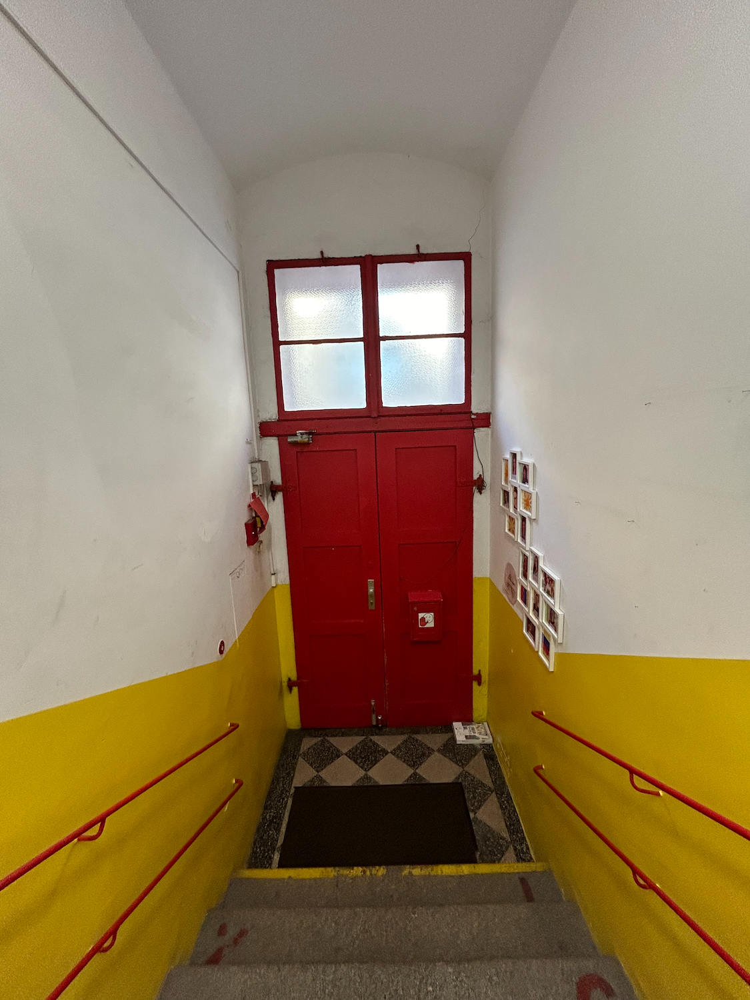

# Neugestaltung Eingangsbereich

Der Eingangsbereich ist das erste was man sieht vom Kindergarten. Er sollte dementsprechend einladend gestaltet sein.

Die Eingangstür sollte ersetzt werden. Jakob holt dazu gerade Angebote von Firmen ein. Die zweite Tür vom Eingangsbereich zum Gang wird entweder repariert oder auch ersetzt. Vor allem muss hier ein Schloss/Drücker eingebaut werden, der von Kindern nicht erreicht werden kann.

Folgende Arbeiten sollten im Rahmen eines Reparaturfestes gemacht werden:

1. Verlegung aller Leitungen unter Putz
1. Neue Schalter/Taster für Licht / Türöffner
1. Evtl. Schaltschrank für die Türelektronik unter Putz
1. Entfernung des dubiosen "Not Aus" Schalters
1. Alles Verspachteln und neu ausmalen in nicht ganz so altmodischen Farben
1. Eventuell Neugestaltung der Pinnwände und Personalfotos

##  Hintergrundinformationen

Die Prüfung der Bildungsdirektion enthält folgenden Mangel:

> Der Eingangsbereich ist so zu gestalten, dass das Betreten des Gebäudes durch betriebsfremde Personen und das Verlassen des Gebäudes durch Kinder verhindert wird.

Um das sicherzustellen sollte zumindest der Code der Eingangstür regelmäßig geändert werden, und die innere Tür sollte auch Kindersicher werden.

In den Richtlinien der Bildungdirektion steht:

> **Prinzipien zur Gestaltung des Eingangsbereichs/Foyers:**
>
> Der Eingangsbereich prägt maßgeblich den ersten Eindruck von der Einrichtung und empfängt
> Kinder und Eltern noch bevor sie von der Pädagogin/dem Pädagogen begrüßt werden. Er hat damit
> eine Brückenfunktion und ist Start- und Landebahn im täglichen Übergang zwischen Familie und
> Kinderbildungs- und -betreuungseinrichtung.
>
> Zugleich kann der Eingangsbereich, je nach Größe, ein wichtiger Begegnungsort sein.
>
> - angenehme freundliche Willkommensatmosphäre für Kinder und Eltern (Begrüßungsplakat
>   in verschiedenen Sprachen, Jahreszeitentisch, bebilderter Speiseplan, Fotogalerie etc.)
> - das Team der Einrichtung vorstellen
> - Möglichkeiten der Orientierung schaffen (Beschilderung, Wegweiser etc.)
> - das Besondere der eigenen Einrichtung darstellen (Leitbild, Wertehaltungen, Logo der
>   Einrichtung etc.)

