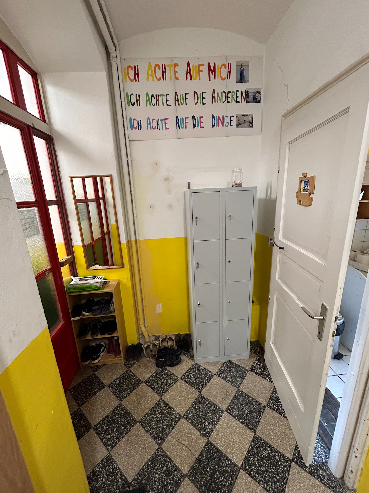

# Personalgarderobe Erdgeschoß

Die Bildungsdirektion hat uns vorgeschrieben, Spinds für die Mitarbeiter zu installieren.

Leider sind diese optisch nicht sehr ansprechend, und für Schuhe und Jacken ist jetzt im Erdgeschoß kaum mehr Platz.

Die Personalgarderobe sollte einerseits funktional sein, aber da jeder daran vorbeigeht wäre es toll wenn sie etwas freundlicher aussehen würde.

Ideen:

1. Eventuell kann man die Spinds auf einen Sockel stellen, so dass darunter Platz für Schuhe ist
2. Spinds mit einer Holzplatte verkleiden
2. Neben den Spinds eine Garderobe einbauen: Rückwand mit Stoff bespannt, große Haken, Sitzfläche aus Holz, darunter Ablage für Schuhe
3. Rohre im Eck links verkleiden
4. Notwendigkeit des Rohrverbaus rechts hinten im Eck überprüfen. Wenn man das Ding wegstemmen könnte, dann könnte man die Spinds weiter  rechts aufstellen.