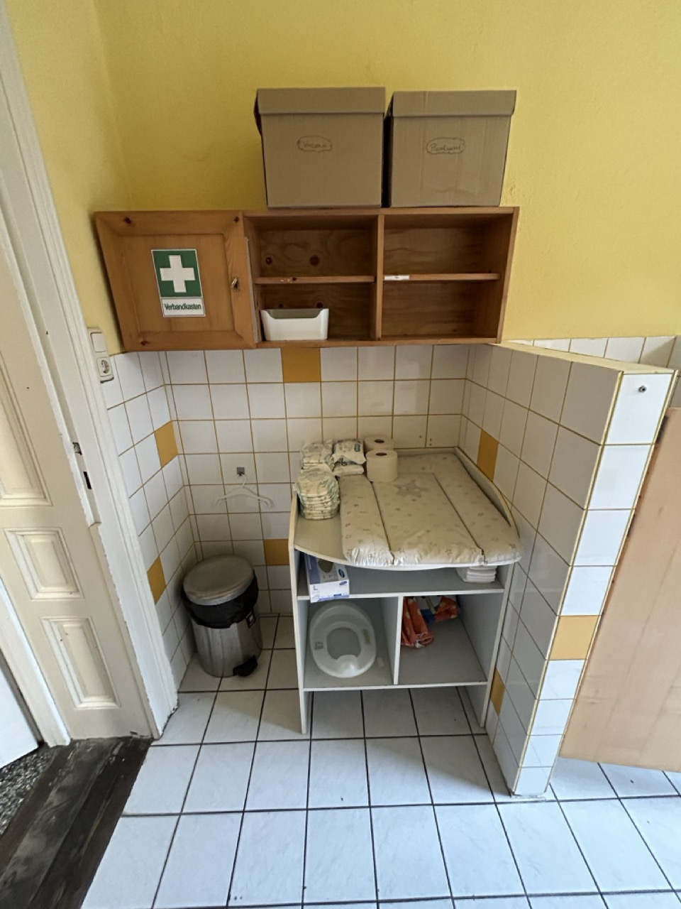

# Wickeltisch Erdgeschoß

Der Wickeltisch benötigt Stufen haben, damit die Kinder selber auf- und absteigen können.

Hygienische Aufbewahrungsmöglichkeiten für Windeln, Unterlagen, Feuchttücher und Handschuhe: Entweder Schubladen im Wickeltisch oder ein mit Türen verschließbarer Schrank / Oberschrank.

Entweder wir bauen ganz was neues, oder wir bauen eine Treppe oder Leiter für den bestehenden Wickeltisch. Schränke die vielleicht verwendet werden können stehen am Dachboden.