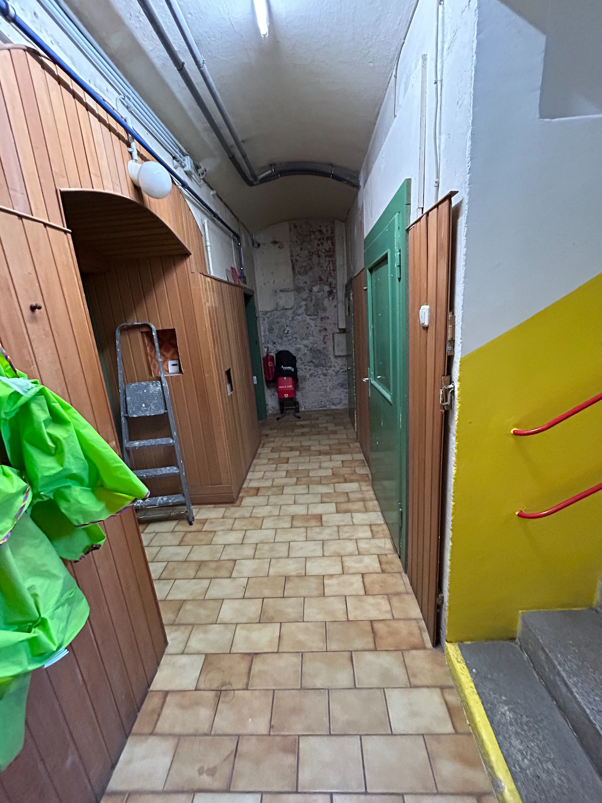

# Kellertüren

Die Türen zu Werkstatt, Abstellkammer und Gartengeräteraum im Keller sind in einem desolaten Zustand.

Um zu verhindern dass Kinder auf dem Weg zum Bewegungsraum diese Räume betreten, sollten diese 3 Türen ausgetauscht werden.

Im Durchgang vom Gang zum nächsten Kellerraum in dem Putzmittel gelagert werden sollte eventuell auch eine Tür eingebaut werden, damit Kinder dort nicht mehr hingelangen können.

Ich schlage vor, Stahltüren ("Brandschutztüren") im Keller einzubauen. Diese sind nicht viel teurer als normale Türen, sind aber vermutlich weniger feuchtempfindlich und bieten auch einen gewissen Brandschutz (auch wenn nicht undbedingt eine Brandschutztüre notwending wäre).

Ich schlage vor die grauen Stahltüren freundlich zu bemalen.