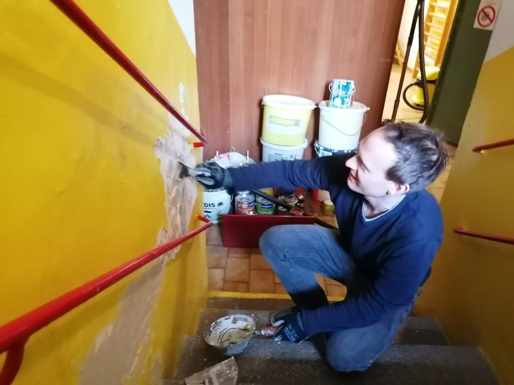

# Kellerabgang

Wir haben beim Reparturfest im Jänner schon angefangen, die Putzschäden im Kellerabgang auszubessern.

Diese Arbeiten müssen fertig gemacht werden.

- gespachtelte Flecken glatt schleifen
- neu ausmalen

Wir haben anscheinend noch was von der gelben Farbe, aber ich würde die Wände lieber in einem moderneren, freundlicheren Farbton ausmalen.